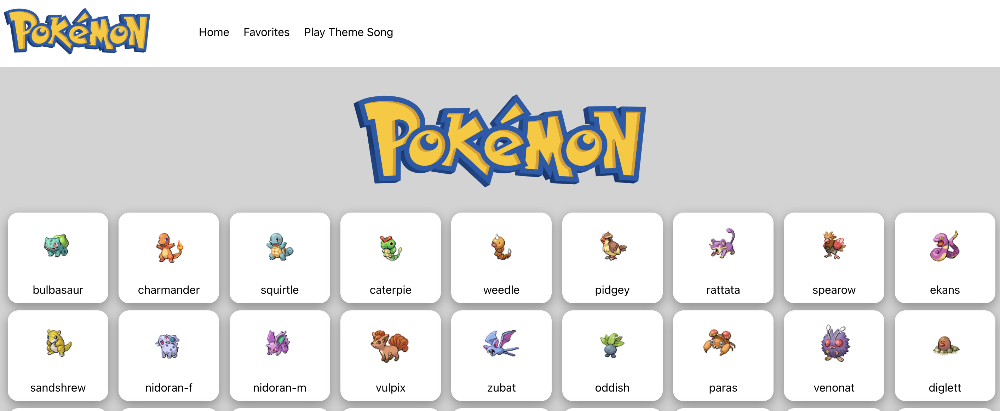
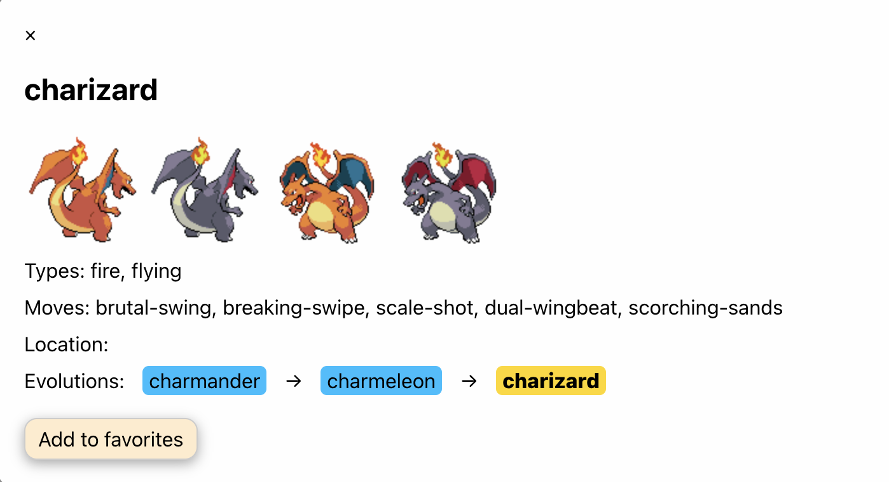

      <h1>  pokeda</h1>
     

   

# Description

Playing around with react and RESTful APIs. And Pokemons, of course.

# Features

A sort of "Pokédex", using the [pokeapi](https://pokeapi.co/) to display the first generation of Pokemon.

- Theme song playback
- Option to save favorite Pokemons
- Display the Pokemon locations, moves, and Evolution chain

# Tech Used

